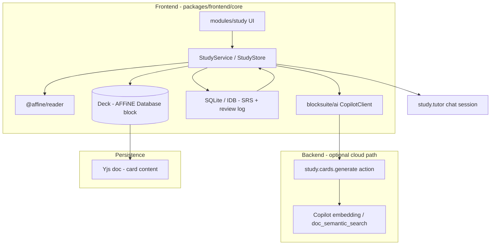

# Scholar Learning Platform — Design Doc

> **Status:** Draft  
> **Audience:** Engineers working on the Scholar fork of AFFiNE  
> **Last updated:** 2026-05-29

## Summary

Scholar extends AFFiNE from a knowledge workspace into a **learning loop**: notes → generated cards → spaced review → deep synthesis with AI. This document defines scope, architecture, data models, and a phased rollout that reuses existing AFFiNE building blocks (BlockSuite docs, databases, Copilot, `@affine/reader`, `nbstore`, workspace embeddings) while adding a dedicated **study domain** that AFFiNE does not ship today.

**North star:** A user can select a page, generate a deck grounded in their notes, review on a schedule, and open a tutor session for open-ended synthesis cards — without leaving the workspace.

---

## Goals

| Goal                    | Description                                                                                                                                |
| ----------------------- | ------------------------------------------------------------------------------------------------------------------------------------------ |
| **Generate from notes** | Produce recall and synthesis items from a doc, block selection, or semantic scope (page / section).                                        |
| **Provenance**          | Every card links back to source `docId` (+ optional block range or chunk id).                                                              |
| **Spaced repetition**   | FSRS (preferred) or SM-2 scheduling with Again / Hard / Good / Easy.                                                                       |
| **Deep synthesis**      | Rubric-based open questions with AI chat; self-grade or optional AI-assisted grade.                                                        |
| **Local-first**         | Review state and queues work offline; sync policy is explicit (see [Sync](#sync-and-multi-device)).                                        |
| **Fork-friendly**       | Isolate code under `packages/frontend/core/src/modules/study/` and backend `plugins/copilot` extensions so upstream merges stay tractable. |

## Non-goals (v1)

- Full Anki feature parity (add-ons, filtered decks, advanced statistics).
- Replacing AFFiNE’s editor or database product surface.
- Automated “course authoring” across unrelated workspaces without user intent.
- Proctored exams or institutional LMS features.
- Training custom embedding models.d

---

## Product principles

1. **Retrieval over recognition** — Recall cards require production, not multiple choice.
2. **Mechanism over parroting** — Answers explain _why_; generation prompts reject verbatim note text.
3. **Synthesis tests judgment** — Scenario / tradeoff / debugging prompts with rubrics, not “explain X.”
4. **Human in the loop** — User reviews, edits, and deletes generated cards before they enter SRS.
5. **Scheduling is private and high-churn** — SRS fields live in a sidecar store, not Yjs CRDT props.
6. **AI is optional per step** — Generation and tutor chat consume quota; review works offline.

Card-quality rules for generation should align with the existing [quiz-generator skill](https://github.com/) spec (recall + synthesis, misconceptions, rubrics). That skill’s `questions.json` schema is the reference for Copilot structured output.

---

## User journeys

### J1 — Generate deck from page

1. User opens a doc → **Study → Generate deck from page** (or context menu on selection).
2. Client extracts text via `@affine/reader` (full doc or selection).
3. Copilot action `study.cards.generate` returns structured JSON (validated server-side).
4. UI shows **preview grid**: accept / edit / reject per card.
5. Accepted cards are written to a **Study Deck** (database block or dedicated deck doc).
6. SRS rows are created in the study sidecar with `state: new`.

### J2 — Daily review

1. User opens **Study** view (sidebar section or command palette).
2. Queue = cards where `due <= now`, ordered by due date + priority (overdue first).
3. Recall: show question → reveal answer → grade (1–4).
4. Synthesis: show prompt → optional **Open tutor** → reveal rubric → grade.
5. Scheduler updates interval; review log appended.

### J3 — Deep synthesis (tutor)

1. From a synthesis card in review (or deck table), **Open tutor**.
2. New or linked Copilot session with mode `study.tutor`:

- System context: card question, rubric, source excerpts (from provenance).
- User discusses; AI does not reveal rubric until user requests **Reveal rubric** or grades.

3. On grade, client writes `lastGrade`, `lastReviewAt`, schedules next due via SRS.
4. Optional: user attaches tutor transcript id to card for audit.

### J4 — Return to source

- **View source** opens the origin doc and scrolls to block range (peek view or split).

### J5 — Anki interchange (phase 4)

- Export deck → `.apkg` (subset of card types).
- Import `.apkg` → Study Deck + sidecar SRS (lossy mapping documented).

---

## Architecture overview



### Layer responsibilities

| Layer                      | Responsibility                                                                                                                      |
| -------------------------- | ----------------------------------------------------------------------------------------------------------------------------------- |
| **Deck (YDoc / Database)** | Stable card identity, question/answer/rubric text, tags, source links, user edits.                                                  |
| **Study sidecar**          | `due`, `interval`, `stability`, `difficulty`, `reps`, `lapses`, `state`, bury/suspend flags.                                        |
| **Copilot**                | Generation (`study.cards.generate`), tutor sessions (`study.tutor`), optional semantic chunking via existing `doc_semantic_search`. |
| **Reader**                 | Canonical text extraction from docs for prompts.                                                                                    |
| **Review UI**              | Queue, grading, stats; no business logic in BlockSuite blocks beyond display.                                                       |

---

## Data model

### Card types

```typescript
type CardType = 'recall' | 'synthesis';

interface StudyCardContent {
  id: string; // nanoid, stable across renames
  deckId: string;
  type: CardType;
  question: string;
  /** Recall only */
  answer?: string;
  misconceptions?: string[]; // shown on back
  /** Synthesis only */
  rubric?: string[]; // bullet criteria for self-grade
  tags?: string[];
  provenance: {
    workspaceId: string;
    docId: string;
    /** Block ids or serialized range; optional */
    blockIds?: string[];
    /** Embedding chunk id if generated via semantic chunk */
    chunkId?: string;
  };
  createdAt: number;
  updatedAt: number;
  /** User archived; hidden from queue */
  suspended: boolean;
}
```

### Deck

A **deck** is a first-class object:

- **v1 storage:** AFFiNE **database block** in a doc titled e.g. `Study / {deck name}` with columns: `id`, `type`, `question`, `answer`, `rubric` (JSON), `tags`, `sourceDoc`, `sourceBlocks`, `suspended`.
- **Alternative (phase 2+):** Dedicated `affine:study-deck` block or workspace-level deck registry in `AFFiNE_WORKSPACE_DB_SCHEMA`.

Deck metadata (name, description, default daily limits) can live in workspace DB:

```typescript
// packages/frontend/core/src/modules/db/schema/schema.ts (proposed)
studyDeckMeta: {
  id: f.string().primaryKey(),
  name: f.string(),
  sourceDocId: f.string().optional(),
  newPerDay: f.number().optional(),
  maxReviews: f.number().optional(),
  createdAt: f.number(),
}
```

### SRS state (sidecar only)

```typescript
type CardState = 'new' | 'learning' | 'review' | 'relearning';

interface StudyCardScheduling {
  cardId: string;
  deckId: string;
  state: CardState;
  due: number; // unix ms
  stability: number; // FSRS
  difficulty: number;
  elapsedDays: number;
  scheduledDays: number;
  reps: number;
  lapses: number;
  lastReviewAt?: number;
  lastGrade?: 1 | 2 | 3 | 4; // Again Hard Good Easy
  buriedUntil?: number;
}
```

### Review log (append-only)

```typescript
interface ReviewLogEntry {
  id: string;
  cardId: string;
  deckId: string;
  reviewedAt: number;
  grade: 1 | 2 | 3 | 4;
  timeMs: number; // time on card
  type: CardType;
  /** Optional link to copilot session for synthesis */
  tutorSessionId?: string;
}
```

### ID linking

- `cardId` is the join key between database row (content) and sidecar row (scheduling).
- On card delete: remove sidecar row; on deck delete: cascade or orphan policy (default: cascade).

---

## Storage strategy

### Why split content and scheduling?

AFFiNE docs sync via Yjs (`nbstore`). SRS fields update on every review and cause merge noise if stored on block props. **Scheduling and logs belong in a sidecar**, similar to `userspace` editor settings (`packages/frontend/core/src/modules/userspace/schema`).

### Proposed sidecar location

| Platform | Implementation                                                                                                                                 |
| -------- | ---------------------------------------------------------------------------------------------------------------------------------------------- |
| Web      | IndexedDB table `study_scheduling`, `study_review_log` (new tables in workspace-scoped IDB or dedicated DB name `affine-study:${workspaceId}`) |
| Desktop  | SQLite extension alongside existing `packages/common/nbstore/src/impls/sqlite/`                                                                |

Schema migrations versioned with `studySchemaVersion`.

### Deck content in YDoc

- Users can edit questions in the database view like any AFFiNE table.
- **Regenerate card** creates a new revision or overwrites with user confirmation; `cardId` preserved when possible.

---

## Copilot integration

### Action: `study.cards.generate`

Follow the pattern used by `mindmap.generate` (streaming action + output projector in `packages/backend/server/src/plugins/copilot/runtime/action-output-projector.ts`).

**Input (client → server):**

```typescript
{
  workspaceId: string;
  docId: string;
  /** Plain text from reader; client may truncate with hash for idempotency */
  content: string;
  selection?: { blockIds: string[] };
  options?: {
    recallCount?: number;      // default 10-20
    synthesisCount?: number;   // default 10+
    focus?: string;            // optional topic filter
  };
}
```

**Output (structured JSON schema via `generateStructuredValue`):**

```typescript
{
  deckName: string;
  deckConcepts?: string[]; // kebab-case slugs for deck vocabulary
  recall: Array<{
    question: string;
    answer: string;
    concepts: string[]; // 1–3 slugs, required
    prerequisites?: string[]; // 0–2 slugs in deck vocabulary
    misconceptions?: string[]; // short slug phrases
    blockIds?: string[];
    metadata?: StudyCardGenerationMetadata;
  }>;
  synthesis: Array<{
    question: string;
    rubric: string[];
    concepts: string[]; // 1–3 slugs, required
    prerequisites?: string[];
    blockIds?: string[];
    metadata?: StudyCardGenerationMetadata;
  }>;
}
```

**Prompt design:**

- System: retrieval-practice rules (no MCQ, no verbatim, mechanism-focused) plus learning-graph slugs (`deckConcepts`, per-card `concepts`, optional `prerequisites`).
- Context: `content` + optional `doc_semantic_search` chunks for long docs (`packages/backend/server/src/plugins/copilot/tools/doc-semantic-search.ts`).
- Post-process: server validates schema; client normalizes slugs (`study-graph-metadata.ts`), maps prerequisites to `prereq:` tags, and runs preview UI before insert. Saved decks feed the learning graph, adaptive tutor, and intelligence dashboard without manual tagging.

**Registration checklist:**

1. Native / recipe definition (same pipeline as `mindmap.generate`).
2. `projectActionResultToAssistantTurn` case for `study.cards.generate`.
3. Feature flag: `enable_study_generation`.
4. Quota: reuse `CopilotAccessPolicy` / feature kind `study` (new enum value).

### Chat mode: `study.tutor`

Not necessarily a separate action; a **session template** with:

- Pinned card question + rubric (hidden until reveal tool).
- Tool: `study_log_grade` (optional) → writes grade via client callback.
- Context injection from `provenance` via `doc_read` tool.

Reuse:

- `packages/frontend/core/src/blocksuite/ai/` — `CopilotClient`, chat blocks, peek view.
- Existing workspace embedding index (`workspace-indexer-embedding` module).

---

## SRS algorithm

**Default:** [FSRS](https://github.com/open-spaced-repetition/fsrs4anki) (library: `ts-fsrs` or port). **Fallback:** SM-2 for simpler v1 if FSRS integration slips.

| Grade   | Meaning                         |
| ------- | ------------------------------- |
| 1 Again | Failed recall                   |
| 2 Hard  | Correct with serious difficulty |
| 3 Good  | Correct with some effort        |
| 4 Easy  | Effortless                      |

**Queue ordering:**

1. Learning / relearning cards due in-session.
2. Review cards `due <= now`, oldest first.
3. New cards up to `newPerDay` cap.

**Leech policy (v2):** suspend card when `lapses >= 8` and surface in UI.

---

## UI surfaces

### Navigation

- Sidebar: **Study** (icon + badge with due count).
- Routes: `/study`, `/study/review`, `/study/decks/:deckId`, `/study/stats`.

### Key components (proposed module layout)

```
packages/frontend/core/src/modules/study/
  index.ts                    # configureStudyModule
  services/study.ts           # StudyService
  stores/
    study-sidecar.ts          # scheduling + logs
    study-deck.ts             # database binding
  views/
    StudyHome.tsx
    ReviewSession.tsx
    DeckDetail.tsx
    GeneratePreview.tsx
  entities/
    card.ts
    deck.ts
  utils/
    fsrs.ts
    extract-doc-text.ts       # wraps @affine/reader
```

### Review session UX

- Full-screen focus mode (keyboard: `1-4` grade, `Space` reveal).
- Mobile: swipe grades (feature-flagged).
- End screen: reviewed count, time, retention estimate.

### Editor integration

- Doc header menu: **Generate study deck**.
- Block context menu: **Add selection to deck** / **Generate from selection**.

---

## Sync and multi-device

| Data                | v1 policy                | v2 policy                              |
| ------------------- | ------------------------ | -------------------------------------- |
| Deck content (YDoc) | Existing AFFiNE doc sync | Same                                   |
| SRS sidecar         | **Device-local**         | Optional encrypted cloud blob per user |
| Review logs         | Device-local             | Merge by append (CRDT-friendly)        |

Cloud sync of SRS is non-trivial (conflict on same card). v1 documents “scheduling may differ per device” unless user enables sync (last-write-wins per `cardId` with `updatedAt`).

---

## Security and privacy

- Generation sends doc text to Copilot providers — same trust model as existing AI features.
- Tutor sessions stored under existing Copilot session retention policies.
- Sidecar DB is local; no new PII fields beyond card content already in workspace.
- Self-hosted: generation works with BYOK (`packages/backend/server/src/plugins/copilot/byok/`).

---

## Phased rollout

### Phase 1 — Generate & browse (MVP)

- `study` module skeleton + feature flag
- `study.cards.generate` action + JSON schema
- Generate preview UI → insert database deck
- Manual flip review (no SRS)
- View source from card

**Exit criteria:** User can create a deck from a real doc and step through cards manually.

### Phase 2 — SRS & daily queue

- Sidecar schema + FSRS scheduler
- Review session UI + grades
- Due badge in sidebar
- Basic stats (reviews/day, streak)

**Exit criteria:** Cards reschedule correctly over multiple days.

### Phase 3 — Deep synthesis tutor

- `study.tutor` session template
- Rubric reveal flow
- Link session id on review log
- Re-queue from tutor grade

**Exit criteria:** Synthesis cards usable end-to-end with chat.

### Phase 4 — Platform polish

- `.apkg` import/export
- Deck templates, tags, filtered study
- Interleaving across decks
- Mobile-optimized review
- Cloud SRS sync (optional)

---

## Testing strategy

| Area    | Approach                                                                                     |
| ------- | -------------------------------------------------------------------------------------------- |
| FSRS    | Unit tests: known grade sequences → expected `due`                                           |
| Schema  | Zod round-trip for generation output                                                         |
| Copilot | Extend `packages/backend/server/src/__tests__/copilot/` with `study.cards.generate` fixtures |
| E2E     | `tests/affine-local/e2e/study/` — generate → accept → review one card                        |
| Reader  | Snapshot doc fixtures → extracted text length / headings                                     |

---

## Observability

- Telemetry events (opt-in): `study_deck_created`, `study_cards_generated`, `study_review_completed`, `study_tutor_opened`.
- Copilot usage tagged with `actionId: study.cards.generate` for quota dashboards.

---

## Open questions

1. **Deck as database vs custom block** — Database is faster for v1; custom block gives richer card templates later.
2. **Workspace vs user scope** — Decks per workspace (default) or cross-workspace “library”?
3. **Shared decks** — Real-time collaborative editing of cards vs single-writer?
4. **AI grading** — Offer optional “suggest grade” from tutor transcript (cost + trust)?
5. **Upstream** — Contribute generic “structured generation → database” or keep Scholar-only?

---

## Appendix A — Generation JSON schema (Zod sketch)

```typescript
import { z } from 'zod';

const StudyConceptSlugSchema = z.string().min(2).max(40);
const StudyCardGraphMetadataSchema = z.object({
  concepts: z.array(StudyConceptSlugSchema).min(1).max(3),
  prerequisites: z.array(StudyConceptSlugSchema).max(2).optional(),
});

export const StudyCardsGenerateOutputSchema = z.object({
  deckName: z.string().min(1).max(120),
  deckConcepts: z.array(StudyConceptSlugSchema).max(20).optional(),
  recall: z
    .array(
      z
        .object({
          question: z.string().min(10),
          answer: z.string().min(10),
          misconceptions: z.array(z.string()).max(3).optional(),
          blockIds: z.array(z.string()).optional(),
        })
        .merge(StudyCardGraphMetadataSchema)
    )
    .min(1)
    .max(30),
  synthesis: z
    .array(
      z
        .object({
          question: z.string().min(20),
          rubric: z.array(z.string().min(5)).min(2).max(8),
          blockIds: z.array(z.string()).optional(),
        })
        .merge(StudyCardGraphMetadataSchema)
    )
    .min(1)
    .max(30),
});
```

Wire via `toToolJsonSchema` (`packages/backend/server/src/plugins/copilot/tools/json-schema.ts`).

---

## Appendix B — Related codebase map

| Concern                                 | Location                                                                         |
| --------------------------------------- | -------------------------------------------------------------------------------- |
| Doc text extraction                     | `packages/common/reader`                                                         |
| Copilot structured output               | `packages/backend/server/src/plugins/copilot/runtime/capability-runtime.ts`      |
| Action output projection                | `packages/backend/server/src/plugins/copilot/runtime/action-output-projector.ts` |
| Semantic search over workspace          | `packages/backend/server/src/plugins/copilot/tools/doc-semantic-search.ts`       |
| AI chat UI                              | `packages/frontend/core/src/blocksuite/ai/`                                      |
| Workspace ORM schema                    | `packages/frontend/core/src/modules/db/schema/schema.ts`                         |
| Local user settings pattern             | `packages/frontend/core/src/modules/userspace/`                                  |
| Module registration                     | `packages/frontend/core/src/modules/index.ts`                                    |
| Doc summary (similar AI feature module) | `packages/frontend/core/src/modules/doc-summary/`                                |
| Local / IDB storage                     | `packages/common/nbstore/`                                                       |

---

## Appendix C — Glossary

| Term               | Definition                                          |
| ------------------ | --------------------------------------------------- |
| **Recall card**    | Closed Q→A; graded after revealing answer.          |
| **Synthesis card** | Open prompt + rubric; self-graded against criteria. |
| **Sidecar**        | Non-Yjs store for scheduling and logs.              |
| **Provenance**     | Pointer from card to source doc/blocks.             |
